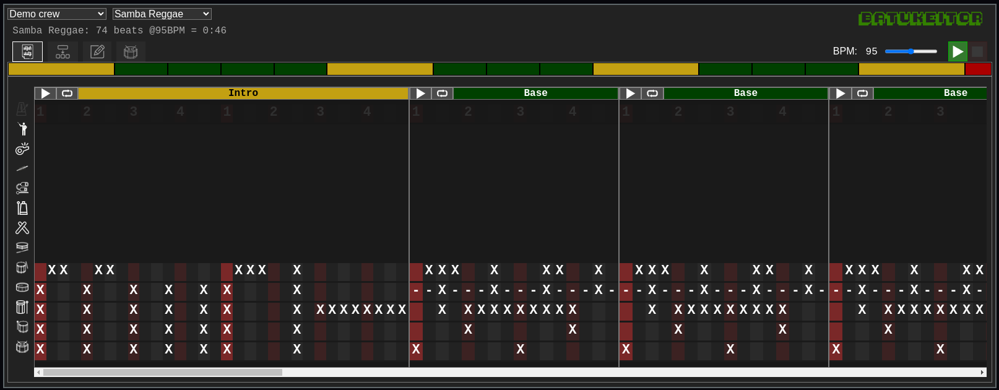
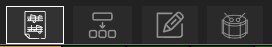

# Batukeitor

_Non-musician-friendly_ score reader/player web app for batucada crews.



## User interface

### Selection combos

* The first combo in the header allows selecting the crew (band/ensemble). The app allows storing scores for multiple crews.
* The second combo in the header allows selecting amongst the crew's score list.

### Score info


Some information about the score is displayed below. Note that calculated total time is an approximation.

### Playback controls

* In the right part of the header:
  * A `BPM` slider (resettable by clicking on the `BPM` word).
  * A `play` button to start playing the whole score.
  * A `stop` button.

### App tabs (screens)

The three icons below the song info allow changing between the app screens (tabs).
*  Full score tab
*  Score sections tab
*  Instruments tab

### Minimap

Below these controls is the `minimap`, a visual representation of the sequence of sections used in the score.

* Each section of the score has its own color, and their size is proportional to their time duration.
* If you place your mouse over any of them its name will be displayed.
* You can click on any of the sections to go to that section in the `Full score tab`.

###  Full score tab

In this tab you can view, play and "play with" the whole score:

All sections are shown in the order set in the score (same as in the `minimap`, but with all instruments and notes).

Each section has a `play` and a `loop` button:
  * `play` will play the score from this point on.
  * `loop` will repeatedly play the section.


The instrument icons can be clicked to mute individual tracks. (shift+click will `solo` the track).


###  Score sections tab

This one is mostly for practicing individual sections:
* All different sections are displayed vertically.
* Sections are displayed once (never repeated).
* `play` button plays the section.
* `loop` button loops the section (same as in `Full score` tab).

###  Instruments tab


Here you can:
* Adjust individual instrument volumes.
* Reset individual instrument volumes (by clicking on the loudspeaker icon)
* Hear the configured notes for each instrument.


## Features

### Easy-to-write scores
`Batukeitor` scores are formatted as [yaml](https://en.wikipedia.org/wiki/YAML) text files for easy editing.

While you can edit these `yaml` files with your regular _Note Pad_ (even with _Word_!), it's always recommended to use a more _serious_ text editor for working with text files, some options being:
* [VS Code](https://code.visualstudio.com/) or its free/libre version [VSCodium](https://vscodium.com/).
* [Notepad++](https://notepad-plus-plus.org/).
* [Sublime Text](https://www.sublimetext.com/).

As an example, this fraction of a score file corresponds to 8 beats for 3 surdos:
```yml
      #   "1---2---3---4---1---2---3---4---"
      S3: "X X     XX X    X X  X XXX X    "
      S2: "X       X       X       X       "
      S1: "    X       X       X       X   "
```

Each character corresponds to an eighth note:
* Where a space is found, no sound will be played.
* Where a character is found, the corresponding `sample` for its `instrument` will be played.

Note there can be multiple different sounds for an instrument.  As an example, the repenique has 4 different sounds in the default configuration:
* `X`: Drumstick on center
* `x`: Drumstick on edge
* `-`: Open palm
* `.`: Closed palm

The scores allow you to write all independent sections of a song and then define how you will combine them to _build_ the full song:

```yml
score:
  intro
  base base base base
  base base base cut
  base base base base
  base base base cut
  end

sections:

  intro:
    tracks:
      #   "1---2---3---4---1---2---3---4---"
      S3: "X   X   X  X  X X     X XXXXXXXX"
      S2: "X   X   X  X  X X     X         "
      S1: "X   X   X  X  X X     X         "

  base:
    tracks:
      #   "1---2---3---4---"
      S3: "  X XXXXXXXXX   "
      S2: "    X       X   "
      S1: "X       X       "

  cut:
    tracks:
      #   "1---2---3---4---"
      S3: "X       XX      "
      S2: "X     X X       "
      S1: "X       X       "

  end:
    tracks:
      #   "1---2---3---4---"
      S3: "X               "
      S2: "X               "
      S1: "X               "
```
Please note that these scores are simplified, see the [Demo crew README](https://github.com/clvLabs/batukeitor-crew-demo/tree/master/README.md) for more details on scores.


### Configurable instruments

The `instruments.yml` in the _instruments pack_ allows you to set as many different sounds for each instrument as you wish:

```yml
instruments:

  CH:
    name: "Chocalho"
    samples:
      "X": "CH_hi.mp3"
      "-": "CH_lo.mp3"
      ".": "CH_lo2.mp3"

  AG:
    name: "Agogô"
    samples:
      "X": "AG_hi.mp3"
      "-": "AG_lo.mp3"

  TB:
    name: "Tamborim"
    samples:
      "X": "TB_hi.mp3"
      "-": "TB_lo.mp3"

  RP:
    name: "Repenique"
    samples:
      "X": "RP_Baqueta_Centro.mp3"
      "x": "RP_Baqueta_Aro.mp3"
      "-": "RP_Palma_Abierta.mp3"
      ".": "RP_Palma_Cerrada.mp3"
```


Please see the [instruments pack README](https://github.com/clvLabs/batukeitor-instruments/blob/master/README.md) for more details on instruments.

### Easy hosting

No special software is required to host this app, you can even create a new folder in your existing web space and install `Batukeitor` in there :)


## Limitations
* Audio timing is not always perfect (the app is meant for students, not for an audio studio).
* Current audio samples are not the nicest (but you can change them!).
* Due to the _fixed time_ nature of the score files, triplets are not available.
* Time resolution is limited to eighth notes: while sometimes limiting for the repenique and some embelishments, it keeps the scores easy to write/read.
* No section/score editor, a text editor is needed to create/edit scores.
* Only one combination of sections (song) per score is allowed.
* Only one track per instrument is allowed.
* No time/volume dynamics available in scores.


## Setup

Plese see the [SETUP.md](SETUP.md) file.
