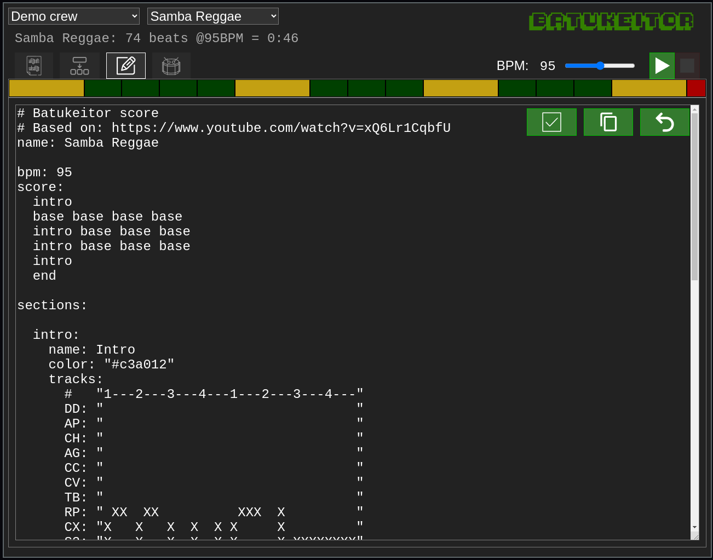

# Batukeitor docs

## Features

### Built-in score player
`Play` / `loop` / `stop` buttons can be found in the interface.

You can:
* Play the entire score.
* Play the score starting from any section.
* Play a single section in `loop` mode to practice.


### Mute instruments
When practicing, you can mute your own instrument and practice with a _virtual version_ of the rest of instruments :)


### Individual instrument volume control


### Minimap
A _quick view_ of the structure of the score.


### Base instruments
* 12 ([configurable](#configurable-instruments)) instrument tracks:
  * `DD`: Diretor
  * `AP`: Apito
  * `CH`: Chocalho
  * `AG`: Agogô
  * `CC`: Cincerro
  * `CV`: Claves
  * `TB`: Tamborim
  * `RP`: Repenique
  * `CX`: Caixa
  * `S3`: Surdo 3ª
  * `S2`: Surdo 2ª
  * `S1`: Surdo 1ª
* Extra track for _Metrónomo_ (not editable in scores).

### Simple score editor
Change scores _on the fly_ and hear the result.

(changes can not be saved... sorry!)


### Easy-to-write scores
`Batukeitor` scores are formatted as [YAML](yaml.md) text files for easy editing.

As an example, this fraction of a score file corresponds to 8 beats for an agogô and 3 surdos:
```yml
      #   "1---2---3---4---1---2---3---4---"
      AG: "X - X - X- -X - X - X - X- -X - "
      S3: "X X     XX X    X X  X XXX X    "
      S2: "X       X       X       X       "
      S1: "    X       X       X       X   "
```

Each character corresponds to an eighth note:
* Where a space is found, no sound will be played.
* Where a character is found, the corresponding `sample` for its `instrument` will be played.

Note there can be multiple different sounds for an instrument.  As an example, the repenique has 4 different sounds in the default configuration:
* `X`: Drumstick on center
* `x`: Drumstick on edge
* `-`: Open palm
* `.`: Closed palm

The scores allow you to write all independent sections of a song and then define how you will combine them to _build_ the full song:

```yml
score:
  intro
  base base base base
  base base base cut
  base base base base
  base base base cut
  end

sections:

  intro:
    tracks:
      #   "1---2---3---4---1---2---3---4---"
      S3: "X   X   X  X  X X     X XXXXXXXX"
      S2: "X   X   X  X  X X     X         "
      S1: "X   X   X  X  X X     X         "

  base:
    tracks:
      #   "1---2---3---4---"
      S3: "  X XXXXXXXXX   "
      S2: "    X       X   "
      S1: "X       X       "

  cut:
    tracks:
      #   "1---2---3---4---"
      S3: "X       XX      "
      S2: "X     X X       "
      S1: "X       X       "

  end:
    tracks:
      #   "1---2---3---4---"
      S3: "X               "
      S2: "X               "
      S1: "X               "
```
Please note that these scores are simplified, see the [Batukeitor YAML score format](batukeitor-yaml-score.md) for more details on scores.

### Configurable instruments
The `instruments.yml` in the _instruments pack_ allows you to set as many different sounds for each instrument as you wish:

```yml
instruments:

  CH:
    name: "Chocalho"
    samples:
      "X": "CH_hi.mp3"
      "-": "CH_lo.mp3"
      ".": "CH_lo2.mp3"

  AG:
    name: "Agogô"
    samples:
      "X": "AG_hi.mp3"
      "-": "AG_lo.mp3"

  TB:
    name: "Tamborim"
    samples:
      "X": "TB_hi.mp3"
      "-": "TB_lo.mp3"

  RP:
    name: "Repenique"
    samples:
      "X": "RP_Baqueta_Centro.mp3"
      "x": "RP_Baqueta_Aro.mp3"
      "-": "RP_Palma_Abierta.mp3"
      ".": "RP_Palma_Cerrada.mp3"
```

Please see the [instruments docs](instruments.md) for more details on instruments.

### Unlimited number of crews
If you want to manage scores for different crews, just add more _crew packs_ into your `data/crews` folder, configure them and have each crew own their scores.

You can even provide custom links for crews such as `http://mysite.com/tools/batukeitor/?crew=batuqueiros`

Please see the [crew packs docs](crew-packs.md) for more details on crews.

### Easy hosting
No special software is required to host this app (pure HTML/css/js).

You can even create a new folder in your existing web space and install `Batukeitor` in there :)

## Limitations
* Audio timing is not always perfect (the app is meant for students, not for an audio studio).
* Current audio samples are not the nicest (but you can change them!).
* Due to the _fixed time_ nature of the score files, triplets are not available.
* Time resolution is limited to eighth notes: while sometimes limiting for the repenique and some embelishments, it keeps the scores easy to write/read.
* Very simple section/score editor.
* No possibility to save scores in the current editor.
* Only one combination of sections (song) per score is allowed.
* Only one track per instrument is allowed.
* No time/volume dynamics available in scores.

#### About the editor limitations
I know... maybe some day I can make a graphical interface...

In the meanwhile you can use the **great** [MestreJS](https://mestrejs.com) app to play around with beats until you get what you want to write. Check it out, it's awesome!

The _saving scores_ thing... I might not do this one. It would need some additional software for database, user authentication and so on... I would rather keep this simple :)
