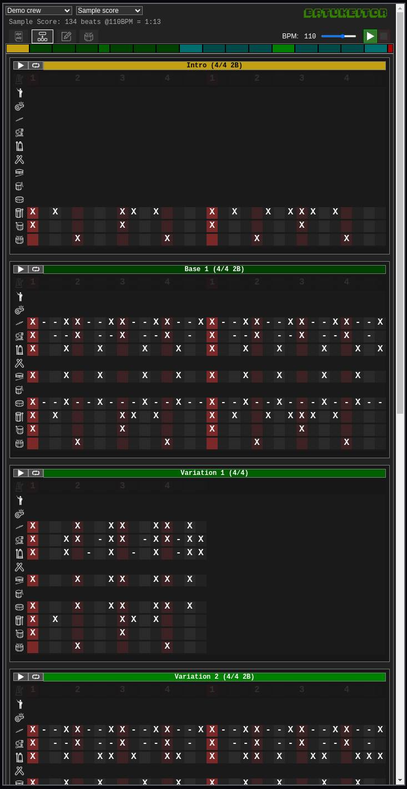

# Batukeitor docs

## User interface

### Selection combos

* The first combo in the header allows selecting the crew (band/ensemble). The app allows storing scores for multiple crews.
* The second combo in the header allows selecting amongst the crew's score list.

### Score info

Some information about the score is displayed below. Note that calculated total time is an approximation.

### Playback controls

* In the right part of the header:
  * A `BPM` slider (resettable by clicking on the `BPM` word).
  * A `play` button to start playing the whole score.
  * A `stop` button.

### App tabs (screens)

The three icons below the song info allow changing between the app screens (tabs).
*  Full score tab
*  Score sections tab
*  Instruments tab

### Minimap

Below these controls is the `minimap`, a visual representation of the sequence of sections used in the score.

* Each section of the score has its own color, and their size is proportional to their time duration.
* If you place your mouse over any of them its name will be displayed.
* You can click on any of the sections to go to that section in the `Full score tab`.

###  Full score tab
In this tab you can view, play and "play with" the whole score:

All sections are shown in the order set in the score (same as in the `minimap`, but with all instruments and samples).

Each section has a `play` and a `loop` button:
  * `play` will play the score from this point on.
  * `loop` will repeatedly play the section.

The instrument icons can be clicked to mute individual tracks. (shift+click will `solo` the track).

###  Score sections tab

This one is mostly for practicing individual sections:
* All different sections are displayed vertically.
* Sections are displayed once (never repeated).
* `play` button plays the section.
* `loop` button loops the section (same as in `Full score` tab).

###  Instruments tab

Here you can:
* Adjust individual instrument volumes.
* Reset individual instrument volumes (by clicking on the loudspeaker icon)
* Hear the configured samples for each instrument.
